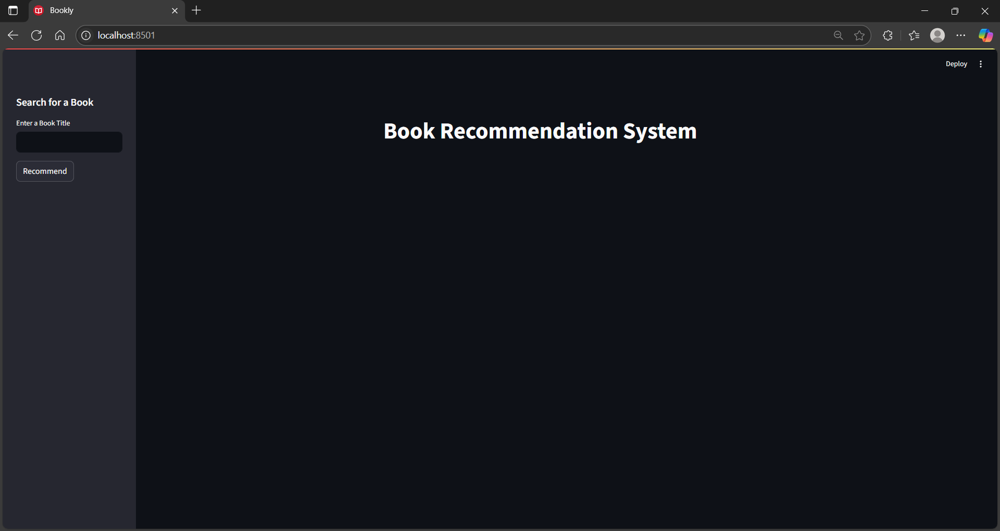
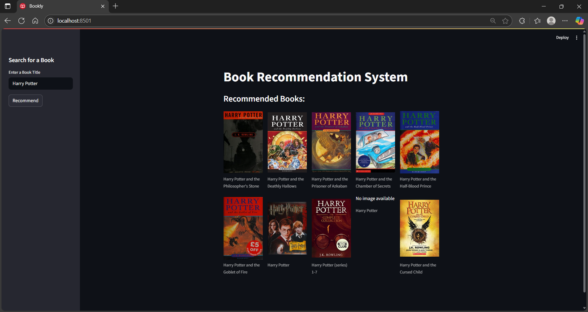

# Book Recommendation System

A simple book recommendation system that suggests similar books based on content descriptions using the Open Library API.

## Preview

### Web Application


### Book Recommendations


## Features

- Search for books using Open Library API
- Get book recommendations based on content similarity
- Clean web interface built with Streamlit
- Book cover images

## Installation

1. Clone the repository:
```bash
git clone https://github.com/rijul-kaushik/book-recommendation-system.git
cd book-recommendation-system
```

2. Install requirements:
```bash
pip install streamlit requests scikit-learn pandas
```

3. Run the app:
```bash
streamlit run book_recommender.py
```

## Usage

1. Enter a book title in the sidebar
2. Click "Recommend" to get similar books
3. Browse through the recommended books with cover images

## How it works

The system uses TF-IDF vectorization on book descriptions and calculates cosine similarity to find books with similar content. It fetches real-time data from the Open Library API.

## Files

- `book_recommender.py` - Main Streamlit application
- `notebook.ipynb` - Jupyter notebook for testing and experimentation

## Requirements

- Python 3.7+
- streamlit
- requests
- scikit-learn
- pandas

## License

MIT License
